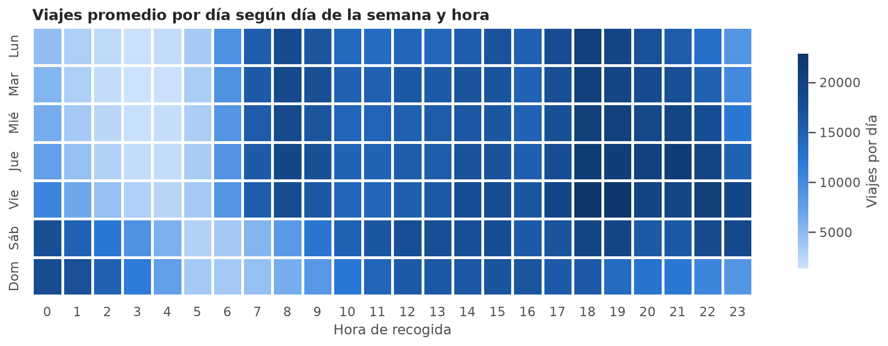

# Operación e integridad tarifaria · Taxis amarillos de NYC

Tablero interactivo sobre los **9.7 millones de viajes** de taxis amarillos de Nueva York registrados en enero de 2017 por la NYC Taxi & Limousine Commission (TLC). Responde tres preguntas de negocio:

1. **Demanda y operación.** ¿En qué zonas, días y horas se concentran los viajes y cuánto ingreso genera cada hora de servicio? Sirve para ubicar la flota.
2. **Integridad tarifaria.** ¿Qué viajes no son consistentes con el tarifario, con su ruta o con sus propios componentes, y cuánto dinero representan? Sirve para priorizar revisiones.
3. **Calidad de datos.** ¿Qué problemas tienen los registros y qué se hizo con cada uno?

**Tablero:** https://juanhv24.github.io/nyc-taxi-ops-dashboard/

El proyecto parte del trabajo integrador de Minería de Datos de la Especialización en Análisis Estadístico para Ciencia de Datos (Universidad de La Salle). Conserva las decisiones de limpieza que tenían evidencia y reemplaza las técnicas que no aportaban a una decisión de negocio sobre este dataset (ver [Qué cambió respecto al curso](#qué-cambió-respecto-al-curso)).

<p align="center">
  
</p>

## Resultados principales

| Tema | Resultado |
|---|---|
| Base analítica | 9,673,906 viajes (99.62% de los registros). Se excluyen 9,059 filas de cargos anulados, 29 duplicados, 9,331 viajes con duración ≤ 0 y 18,495 viajes no realizados probables |
| Anulaciones | Los 4,544 "duplicados lógicos" del curso son 4,513 pares cargo + reverso que suman $0 (el 99.3% de los grupos), todos de VeriFone; se reversaron $42,334 |
| Imputación | 6,964 viajes taximetrados sin distancia. La regresión sobre tarifa y duración tiene un error absoluto medio de 0.19 millas, frente a 0.47 de la mediana por par de zonas y 1.53 de la mediana global, y conserva la dispersión real (desv. estándar 2.68 frente a 2.71) |
| Tarifario como regla | El 99.99% de los viajes estándar con duración plausible cae entre `2.50 + 2.50·millas` y `2.50 + 2.50·millas + 0.50·minutos` con una holgura de $1 |
| Auditoría | 64,448 viajes con alguna marca (0.67% de la base) y $469 mil involucrados según la estimación de cada regla |
| Proveedores | Los totales que no concilian son 100% de VeriFone (el 94.5% con una diferencia de exactamente $1.95). Las tarifas por debajo del mínimo son 8.9 veces más frecuentes en Creative Mobile Technologies |
| Tarifa suburbana | 1,702 viajes dentro de los cinco distritos cobrados con el código de Newark o de Nassau/Westchester; los de Manhattan → Manhattan tienen una tarifa mediana de $20 |
| Operación | $65.28 de ingreso por hora de servicio y 13.0 mph en promedio. Entre horas, el ingreso por hora sigue casi exactamente a la velocidad (correlación de 0.99) |

## Estructura del repositorio

```
nyc-taxi-ops-dashboard/
├── data/
│   ├── raw/                         # Datos de la TLC (no se versionan; se descargan)
│   └── processed/                   # Base marcada viajes_marcados.parquet (no se versiona)
├── docs/                            # Tablero estático (GitHub Pages)
│   ├── index.html
│   ├── assets/                      # CSS, JS y ECharts (vendorizado)
│   ├── content/lecturas.md          # Textos interpretativos de cada pestaña
│   └── data/                        # JSON pre-agregados que genera el pipeline
├── notebooks/
│   ├── 01_calidad_imputacion.ipynb  # Evidencia de cada regla de calidad e imputación
│   ├── 02_demanda_operacion.ipynb   # Demanda por zona, día y hora; productividad
│   └── 03_integridad_tarifaria.ipynb# Validación del tarifario y reglas de auditoría
├── reports/figures/                 # Figuras exportadas por los notebooks
├── src/nyc_taxi_ops/
│   ├── config.py                    # Rutas, fuentes, tarifario 2017 y umbrales
│   ├── datos.py                     # Descarga, carga con tipos compactos y zonas
│   ├── calidad.py                   # Reglas de calidad y máscaras de validez por métrica
│   ├── imputacion.py                # Validación y aplicación de la imputación de distancia
│   ├── auditoria.py                 # Reglas de integridad tarifaria e impacto en USD
│   ├── agregados.py                 # Tablas livianas para el tablero
│   ├── pipeline.py                  # Orquestación
│   ├── graficos.py                  # Estilo de las figuras
│   └── cli.py                       # Comando nyc-taxi-ops
├── tests/test_reglas.py             # Pruebas de las reglas con viajes sintéticos
├── pyproject.toml
└── uv.lock
```

## Reproducibilidad

El entorno se gestiona con [uv](https://docs.astral.sh/uv/) (Python 3.13, dependencias fijadas en `uv.lock`). El pipeline descarga los datos de la TLC, construye la base marcada y regenera los agregados del tablero; procesar el mes completo en memoria requiere alrededor de 6 GB de RAM.

```bash
uv sync
uv run nyc-taxi-ops todo     # etapas individuales: descargar, procesar, sitio
uv run pytest
```

El tablero es un sitio estático publicado con GitHub Pages desde la carpeta `docs/`. Consume únicamente los JSON pre-agregados de `docs/data`, por lo que no requiere un backend ni acceso a los 9.7 millones de registros.

## Metodología

### Tratamiento por métrica

Cada regla de calidad genera una marca y el tratamiento depende de la métrica. Un viaje cuya hora de llegada quedó corrupta (el taxímetro se cerró al día siguiente) sigue contando como demanda, pero no entra al cálculo de duración, velocidad ni ingreso por hora. Solo se eliminan los registros que no representan un servicio: anulaciones, duplicados, duraciones ≤ 0 y viajes sin trayecto.

### Reglas de integridad tarifaria

| Regla | Qué detecta | Impacto estimado |
|---|---|---|
| Tarifa por debajo del mínimo | Cobro menor a `2.50 + 2.50·millas` en viajes estándar plausibles | Mínimo − tarifa |
| Tarifa por encima del máximo | Cobro mayor a `2.50 + 2.50·millas + 0.50·minutos` | Tarifa − máximo |
| Tarifa suburbana dentro de NYC | Código 3 o 4 en viajes que empiezan y terminan en los cinco distritos | Tarifa − máximo estándar |
| Tarifa plana JFK distinta de $52 | Código 2 con otra tarifa | Diferencia absoluta |
| Distancia atípica para la ruta | Distancia > mediana + 5 MAD del mismo par origen-destino | Millas adicionales × $2.50 |
| Total que no concilia | Total ≠ suma de tarifa, recargos, impuestos, propina y peajes | Diferencia absoluta |
| Monto implausible | Tarifa o total mayor a $1,000 | No se suma |

Una marca identifica una inconsistencia, no prueba fraude. La regla de tarifa suburbana replica el patrón que la TLC detectó en 2010 con datos GPS: 1.8 millones de viajes dentro de la ciudad cobrados con la tarifa suburbana (NBC News, 2010).

### Qué cambió respecto al curso

| Componente del curso | Decisión | Motivo |
|---|---|---|
| Limpieza y reporte de calidad | Se conserva y amplía | Se agregan reglas de dominio y el tratamiento por métrica |
| "Duplicados lógicos" | Se reinterpretan | Son anulaciones (cargo + reverso), no errores de captura |
| Reglas de asociación (Apriori) | Se retiran | Las reglas fuertes son casi definicionales (tarifa ↔ distancia) y Manhattan está en el 95% de los viajes |
| PCA | Se retira | No comprime; su hallazgo (el total es la suma de sus componentes) pasa a ser la regla de conciliación |
| Z-score, IQR global, Isolation Forest y LOF | Se retiran | Con sesgo extremo marcan viajes largos legítimos (IQR marcaba el 21%); se reemplazan por reglas del tarifario validadas con los datos y por una regla contextual robusta por ruta |
| Anomalías sintéticas | Se retiran | Multiplicar valores por 15 a 50 crea casos triviales que no informan sobre las anomalías reales |
| Imputación sobre faltantes artificiales | Se reemplaza | La comparación de métodos se aplica a un faltante real: la distancia de los viajes taximetrados |
| Categoría explícita para zonas 264 y 265 | Se conserva | Eliminar esos viajes borraría la movilidad hacia fuera de la ciudad |

### Limitaciones

- Un solo mes de datos: no permite medir estacionalidad anual.
- El esquema de 2017 no trae coordenadas, solo zonas de taxi.
- El ingreso de los viajes en efectivo está subestimado porque la fuente no registra esas propinas.
- La regla de desvío puede marcar recorridos alternativos habituales cuando la distribución de distancias de una ruta es bimodal.

## Referencias

NBC News. (2010, marzo). *NYC cabbies ripped off passengers, agency says*. https://www.nbcnews.com/news/amp/wbna35845465

NYC Taxi & Limousine Commission. (s. f.-a). *Data dictionary – Yellow taxi trip records*. https://www.nyc.gov/assets/tlc/downloads/pdf/data_dictionary_trip_records_yellow.pdf

NYC Taxi & Limousine Commission. (s. f.-b). *Taxi information for yellow cabs: Metered fare information*. https://www.nyc.gov/assets/tlc/downloads/pdf/taxi_information.pdf

NYC Taxi & Limousine Commission. (s. f.-c). *TLC trip record data*. https://www.nyc.gov/site/tlc/about/tlc-trip-record-data.page

---

Gráficos del tablero con [Apache ECharts](https://echarts.apache.org/) (licencia Apache 2.0, incluida en `docs/assets/vendor`).
